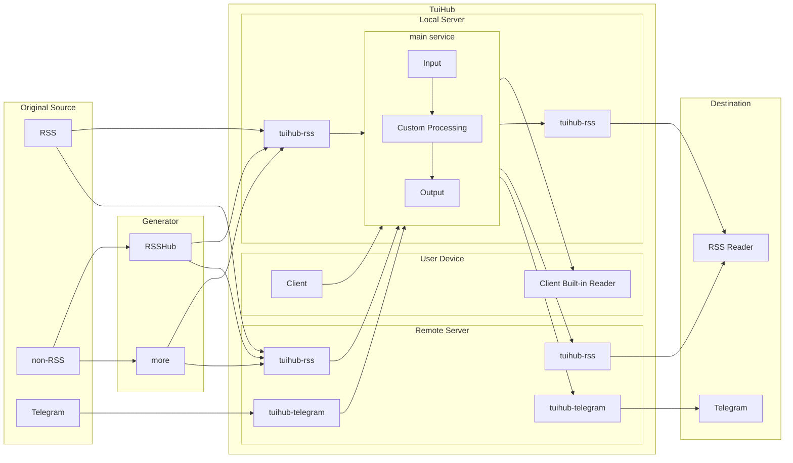
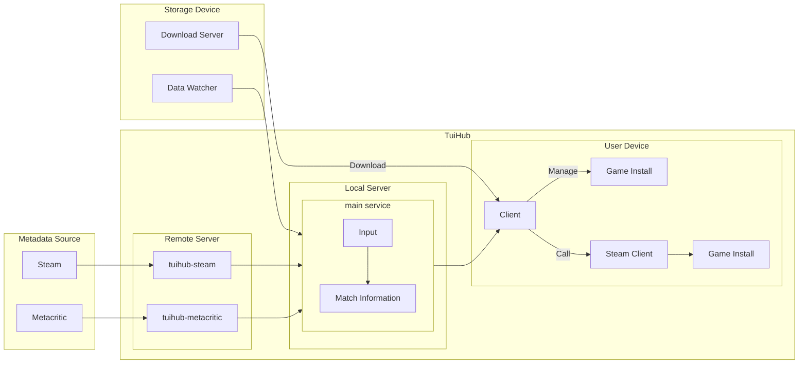

| **This software is currently in alpha phase.**   |
|-----------------------------------------------------------------|

| English | [简体中文](README.zh-CN.md) |
|---------|-----------------------------|

<h1 align="center">
<picture>
  <source media="(prefers-color-scheme: dark)" srcset="static/img/main-dark.webp" width="480">
  
</picture>
</h1>

TuiHub is a free and open-source toolkit for managing your data.

## Use Cases

*Some of the features are still under development.*

### Feed collect and distribute

TuiHub can collect feeds from various sources,
process them with user customize rules,
and distribute to various destinations.
**Collecting, processing, and distributing logic are all extensible.**

The Plugin mechanism allows you to deploy main service near you,
deploy collecting and distributing services at the far end.

### Game Library Management

TuiHub can manage your game (including install files and save files)
and provide a user interface similar to Steam.
**Especially for those who have a large storage for archiving games.**

The Plugin mechanism allows you to keep current storage method
or keep TuiHub read-only to your game storage.

### What's more?

Some ideas that may be achieved or implemented in the future:

- Use Feed functions to sync chat history between different platforms in real-time?
- Use Feed functions to subscribe game news and updates that can display in the game library, just like Steam?
- Customize and export a private download feed to downloader that supports RSS? e.g. auto download telegram files?

## Documentation

Documentation available at **[https://docs.tuihub.org](https://docs.tuihub.org/)**.  
This site is built with [Docusaurus](https://docusaurus.io/).
The documentation is written in Markdown and located in the `docs/` directory.

## Star History

<a href="https://star-history.com/#tuihub/tuihub&tuihub/librarian&tuihub/waiter&tuihub/protos&Date">
 <picture>
   <source media="(prefers-color-scheme: dark)" srcset="https://api.star-history.com/svg?repos=tuihub/tuihub,tuihub/librarian,tuihub/waiter,tuihub/protos&type=Date&theme=dark" />
   <source media="(prefers-color-scheme: light)" srcset="https://api.star-history.com/svg?repos=tuihub/tuihub,tuihub/librarian,tuihub/waiter,tuihub/protos&type=Date" />
   
 </picture>
</a>
