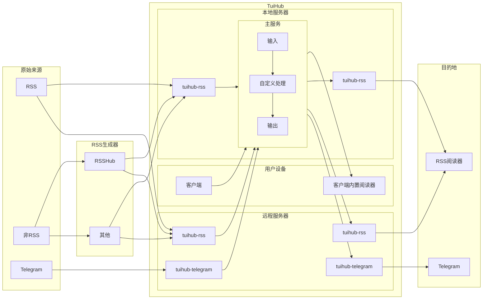
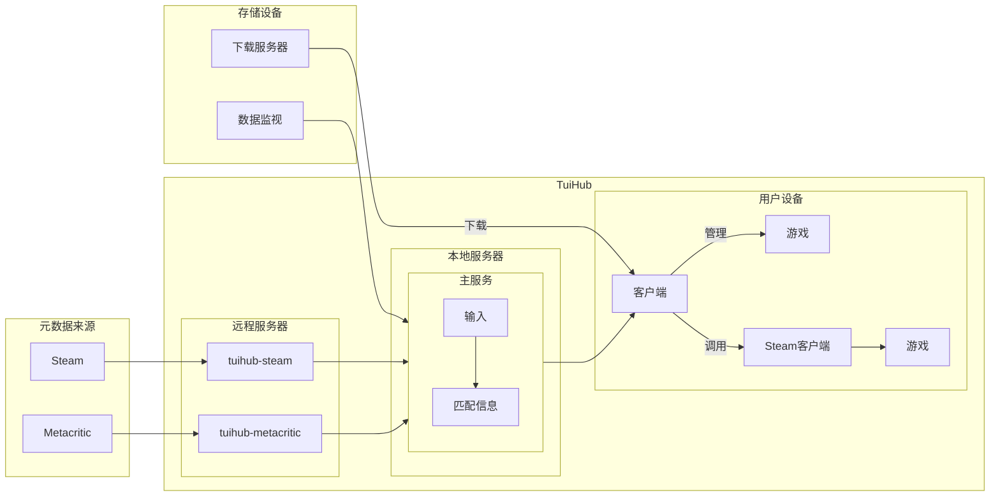

| **本软件目前处于 alpha 阶段。** |
|---------------------|

| [English](README.md) | 简体中文 |
|----------------------|------|

<h1 align="center">
<picture>
  <source media="(prefers-color-scheme: dark)" srcset="static/img/main-dark.webp" width="480">
  
</picture>
</h1>

TuiHub 是一个用于管理数据的免费开源工具集。

## 用例

*某些功能仍在开发中。*

### 信息流收集和分发

TuiHub 可以从各种来源收集信息流，
使用用户自定义规则处理它们，
并将其分发到各种目的地。
**收集、处理和分发逻辑都是可扩展的。**

插件机制允许您在您附近部署主要服务，
在远端部署收集和分发服务。

### 游戏管理

TuiHub 可以管理你的游戏(包括安装文件和保存文件)，
并提供类似于 Steam 的用户界面。
**特别是对于那些准备了大量存储空间存档游戏的用户。**

插件机制允许你保持当前的存储方法或使 TuiHub 对你的游戏存储只读。

### 更多

未来可能实现或实施的一些想法：

- 使用 Feed 功能在不同平台之间实时同步聊天记录？
- 使用 Feed 功能来订阅可以在游戏库中显示的游戏新闻和更新，就像 Steam 一样？
- 自定义和导出一个私人下载 RSS 到支持的下载器？比如自动下载 Telegram 文件？

## 文档

文档位于 **[https://docs.tuihub.org](https://docs.tuihub.org/)**。
该站点使用 [Docusaurus](https://docusaurus.io/) 构建。
文档使用 Markdown 编写，位于 `docs/` 目录。

## Star 历史

<a href="https://star-history.com/#tuihub/tuihub&tuihub/librarian&tuihub/waiter&tuihub/protos&Date">
 <picture>
   <source media="(prefers-color-scheme: dark)" srcset="https://api.star-history.com/svg?repos=tuihub/tuihub,tuihub/librarian,tuihub/waiter,tuihub/protos&type=Date&theme=dark" />
   <source media="(prefers-color-scheme: light)" srcset="https://api.star-history.com/svg?repos=tuihub/tuihub,tuihub/librarian,tuihub/waiter,tuihub/protos&type=Date" />
   
 </picture>
</a>
