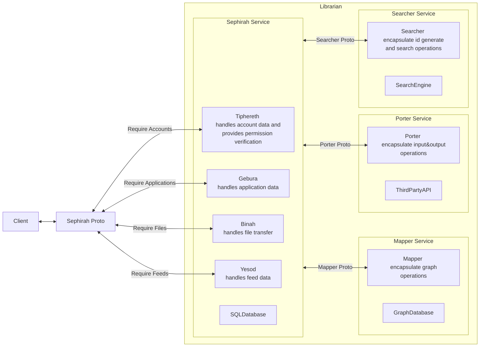

## 系统结构-按耦合度区分

- `Librarian` 服务端
  - `Sephirah` 核心逻辑，`Librarian`的访问入口，不会向外部系统发出连接
  - `Mapper` 图数据库封装
  - `Porter` 外部系统接口封装
  - `Searcher` 搜索引擎封装
- `Waiter` 客户端
- `Sentinel` 监控端，用于特定功能

## 系统结构-按功能区分

功能模块名取自《废墟图书馆》，仅作为区分，没有实际含义  
功能模块之间可能存在无法避免的代码耦合  
**区分功能模块的目的不是为了让每个模块都能独立运行，而是从宏观上划分系统中的各种功能**

- `Tiphereth` 用户与账户模块，提供用户信息存储、登录令牌的生成、身份校验等功能
- `Gebura` 游戏商店模块，为任何游戏或应用提供游戏信息存储、游戏时长统计、存档备份等功能
- `Yesod` 信息流阅读器模块，在实现RSS阅读器的基础上，提供更加丰富的信息流获取与展示功能
- `Binah` 二进制传输模块，所有二进制数据均通过此模块传输
- `Netzach` 通知与推送模块，提供推送端点配置，通知路由等功能
- `Chesed` 截图管理模块，提供截图管理与搜索功能
- `Angela` 当功能逻辑需要跨越不同模块实现时，放入此模块中以标识该部分代码具有较高的耦合度

## 结构图

