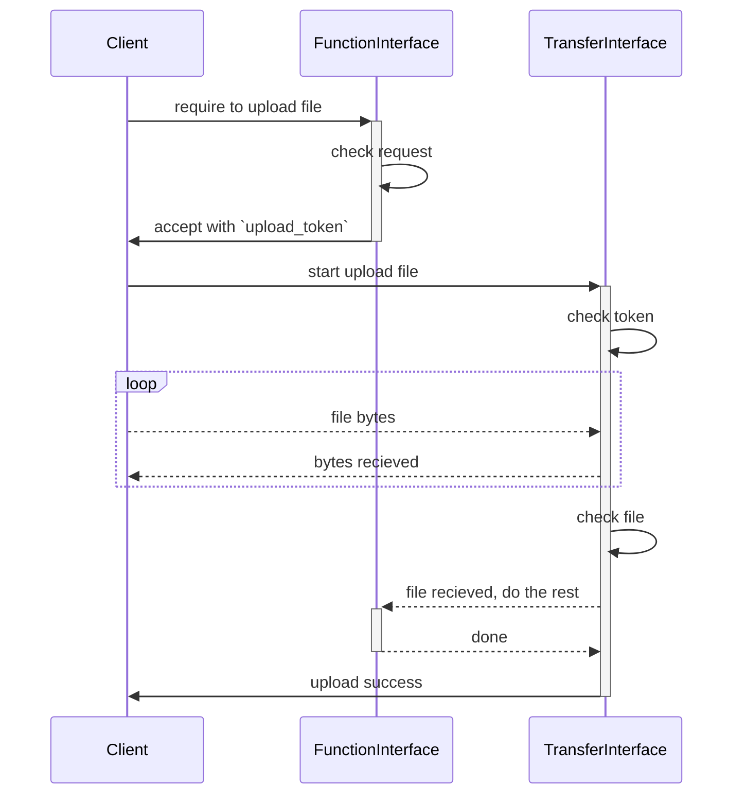
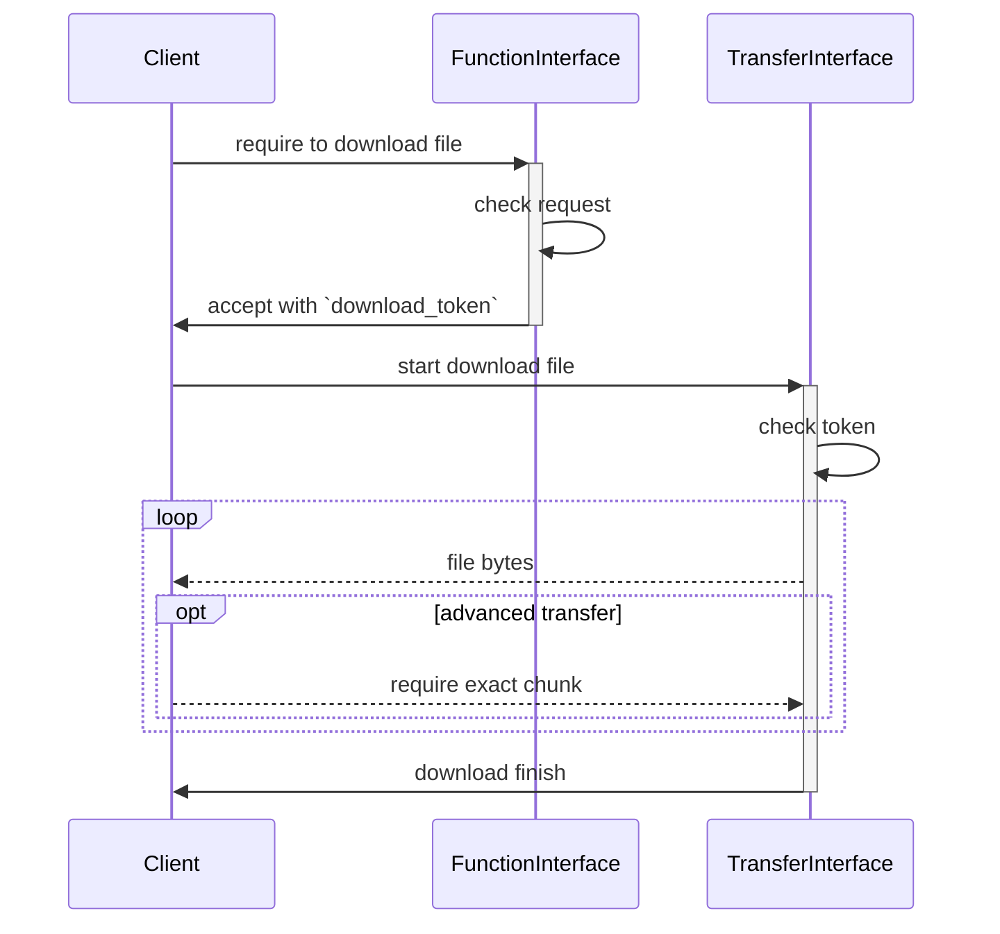

*所有需要传输二进制文件的接口均由此模块完成实际的传输工作*

收发接口通过`upload_token`和`download_token`鉴权，遵循以下要求

- 两种token由其他接口生成，生成token时服务端已得知待传输文件的名称大小等信息，服务端能够通过token得知这些信息
- 两种token有效期不应过长，`upload_token`在上传成功后立即失效，`download_token`不限制下载次数
- 在上传时，上传接口能够根据token信息实现服务端的后续逻辑
- 需要实现三种传输方式
  - gRPC 分块传输：支持文件分块及断点续传
  - gRPC 简单传输：一次连接内完成传输
  - HTTP 传输：通过S3提供的 Presigned Url 进行客户端直传

## 上传

## 下载

