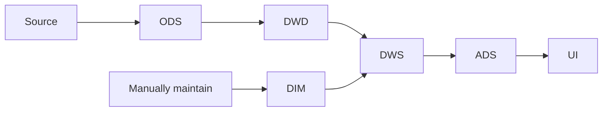

## 背景

原有的游戏信息获取逻辑非常简单，只能满足基本的技术验证需要，无法适应实际使用时的复杂情况。

## 方案

参考数仓分层，将数据处理分为五个层次：
- ODS（原始数据层）：直接从数据源获取数据，不做任何处理，以json格式存储
- DWD（明细数据层）：对原始数据进行清洗，生成统一的结构化数据
- DIM（维度数据层）：保存维度数据（比如各平台id关联关系），用于合并数据
- DWS（汇总数据层）：将 DWD 层的数据进行汇总，可合并的数据合并，不可合并的直接复制
- ADS（应用数据层）：根据实际需要使用 DWS 层数据，例如绑定游戏文件、生成全文搜索索引、推荐数据等

关系图：

备注：
- 本方案基于已实施的插件机制：与每个数据源有关的逻辑都在插件中实现，主服务只负责通用逻辑
- 本方案基于未实施的任务调度机制：本方案中涉及到各种不同触发方式的任务，需要一个任务调度机制来管理
- 本方案为面向开发者的概念，实际接口设计和页面展示不会使用这些术语

### ODS层

触发方式：
- 首次：业务逻辑触发
- 刷新：定时任务触发，全范围生效，频率、并发由管理员配置

逻辑：
主服务调用插件获取数据，插件直接从数据源获取数据，不做任何处理，以json格式返回，主服务将数据保存到数据库。

唯一键：
- 数据源id + 数据源为游戏分配的id

备注：
- 在一般的爬虫实现中，对应ODS层的原始数据是不会持久化保存的，这里选择保存是考虑到数据源有限频，拉取原始数据的速度非常慢，保存原始数据之后如果数据清洗逻辑有变化只需要在服务内进行回溯即可，不需要重新拉取数据。
- 在实际的实现中，为了降低首次拉取的全链路延迟，我们让插件同时返回原始数据（ODS）和清洗后的数据（DWD）

### DWD层

触发方式：
- 自动：ODS 层数据保存后触发（若实现了ODS与DWD同时返回则无需触发）
- 手动：管理员手动触发回溯，触发时设置回溯范围

逻辑：
主服务将原始json数据传给插件，插件对数据进行清洗，生成统一的结构化数据，主服务将数据保存到数据库。

唯一键：
- 数据源id + 数据源为游戏分配的id
关联方式：
- 与 ODS 使用了相同的唯一键，可以直接关联

### DIM层

目前分为两种维度数据：

#### 基于数据集

> 背景：这里的数据集指由项目组维护的数据集 [TuiHub datasets](https://github.com/tuihub/tuihub-datasets) 中的 vndb_id_connector

触发方式：
- 定时：定时任务触发，清除式更新
- 手动：管理员手动触发

逻辑：
主服务直接调用数据集的下载地址，将数据保存到数据库。

备注：
- 数据集提供版本号，主服务可以根据版本号判断是否需要更新
- 为了避免数据集下载失败，可以考虑支持管理员手动上传数据集

#### 基于手动维护

触发方式：
- 手动：管理员手动修改绑定关系时触发

逻辑：
管理员在后台修改绑定关系，主服务将数据保存到数据库。

备注：
- 此维度数据优先级高于数据集，即手动维护的数据会覆盖数据集中的数据

### DWS层

触发方式：
- 自动：DWD 层数据保存后触发
- 手动：管理员手动触发回溯，触发时设置回溯范围

逻辑：
根据 DIM 表中的数据，将 DWD 层的数据进行汇总，可合并的数据合并，不可合并的直接复制。并且额外记录数据的来源，以供管理员手动纠正。

唯一键：
- 依靠关联关系约束
关联关系：
- 首次关联：汇总时使用的 DWD 层数据的唯一键
- 刷新：不改变关联关系，只更新数据
- 纠正：管理员手动纠正时，更新关联关系

备注：
- 在实际实现中，为了避免数据复制造成的空间浪费，可以考虑使用视图代替表

### ADS层

ADS 层取决于具体的业务需求，这里不做详细介绍。