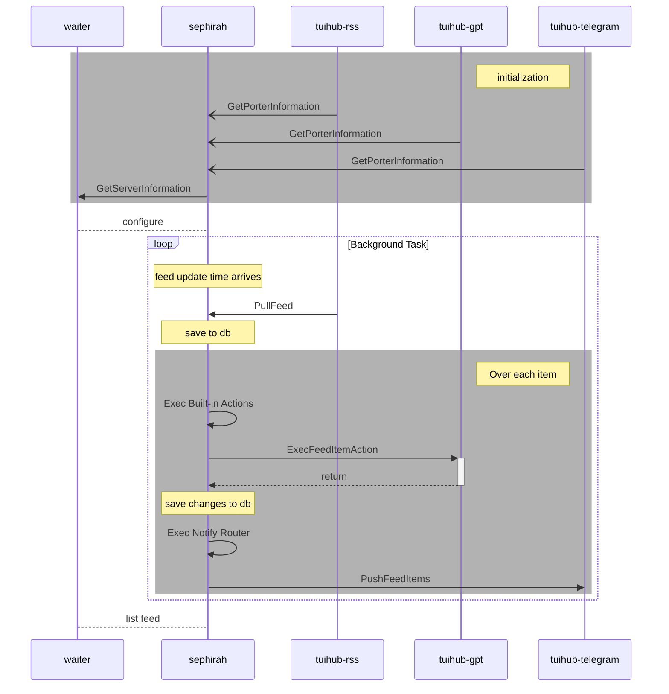

完整的 Feed 数据传输流程涉及 `Yesod` 和 `Netzach` 两个模块，`Yesod` 包含数据导入和处理功能，`Netzach` 包含数据导出功能。

## 概览

以官方插件为例，数据处理过程如图

## 接口

### 获取

官方`tuihub-rss`插件提供了拉模式输入 Feed 数据的例子

### 处理

官方`tuihub-gpt`插件提供了处理 Feed 数据的例子

### 通知

官方`tuihub-telegram`插件提供了推模式输出 Feed 数据的例子
